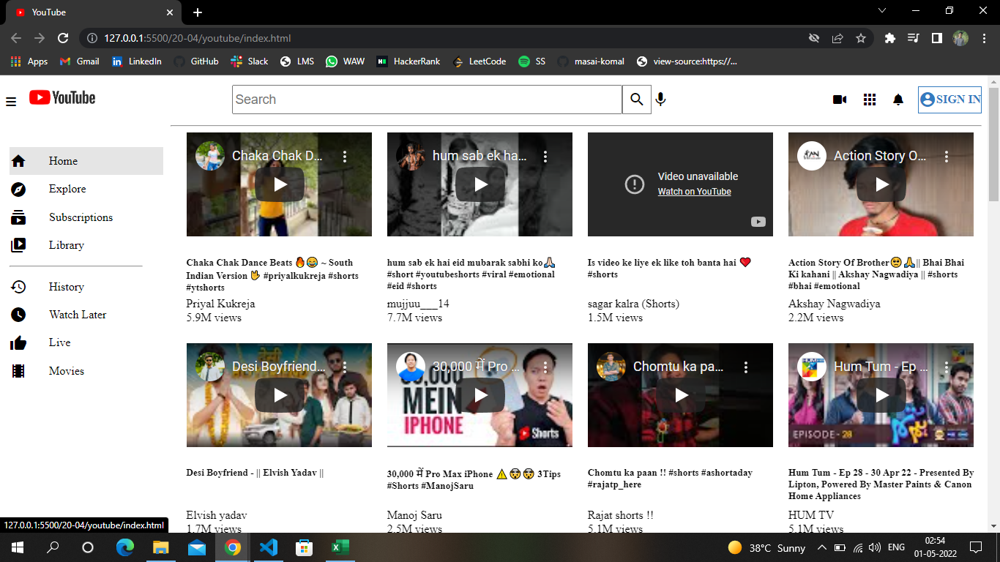
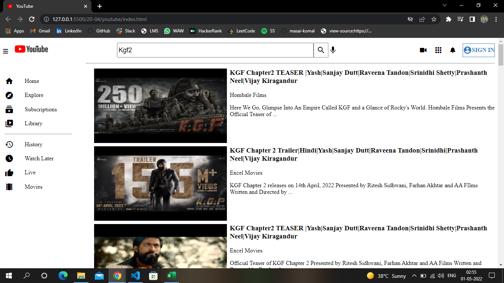

# YouTube_Clone

Deployed Link : https://komal-tiwari-dev.github.io/YouTube_Clone/

Tried To Clone The Youtube WebApplication By Using TechStack :- HTML, CSS and Javascript, Google Api, Google Font Material Icon.

Some Key Features Added:-
1) Fetched Videos From Google Api.
2) Home Pages Has Trending Videos Of India.
3) Search For Any Video Same Like Youtube Will Result Into 30 Top Video.
4) By Clicking On Banner Of Any Searched Video Will Redirect To New Page Where Can Watch Video In Full Length.
5) By Clicking on Home And Youtube Logo Image Will Redireted to Home Page.

Note:Some Videos Might Be Not Available Because Of Free Api And Restriction by Video Owner Mostly With Shorts

Snippets:
1) Home Page:-

2)Home Page 2:-

3)Search Page:-

4)Search Result Page Video:-
